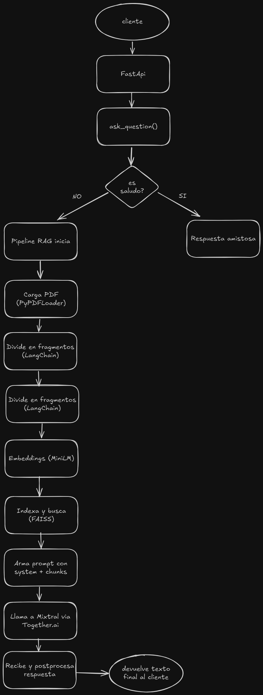

# Documentación del Chatbot RAG Promtior

## 1. Objetivo de la documentación

En este documento presento cómo abordé el reto de construir un asistente conversacional para Promtior utilizando un enfoque RAG. Aquí detallo la lógica de implementación, los principales desafíos y las tecnologías empleadas para que pueda valorarse la solución propuesta.

## 2. Overview del proyecto

Este proyecto monta un pipeline RAG que usa un PDF como única fuente de conocimiento:

1. Cargo y divido el documento en fragmentos con LangChain.
2. Genero embeddings con MiniLM y los indexo en FAISS.
3. Cuando llega una consulta, recupero los trozos más relevantes, compongo un prompt y lo envío al modelo Mixtral-8x7B vía Together.ai.
4. Finalmente limpio y post-proceso la respuesta antes de devolverla al usuario a través de FastAPI.

## 3. Diagrama de flujo

El flujo es el siguiente:

1. El cliente envía un POST al endpoint /chat.
2. FastAPI recibe la petición y llama a ask_question().
3. Dentro de esa función primero detectamos saludos (“hola”, “hi”…). Si es un saludo, devuelve una respuesta amistosa inmediatamente.
4. Si no es saludo, arrancamos el pipeline RAG:
   - PyPDFLoader carga el PDF y LangChain lo divide en fragmentos.
   - Cada fragmento se convierte en vector con MiniLM embeddings.
   - Los vectores van al índice FAISS, que recupera los k chunks más relevantes.
   - Esos chunks se meten en la plantilla de prompt junto al system message.
5. Llama al LLM remoto, Mixtral-8x7B vía Together.ai, con invoke(prompt).
6. REcibe la respuesta, la post procesa (quitam prefijos, filtra URLs o saludos sobrantes).
7. Finalmente FastAPI envía ese texto pulido de vuelta al cliente.

## 4. Funcionamiento del proyecto

Este chatbot basado en RAG responde preguntas sobre la compañía Promtior tomando su información directamente del PDF.  
Cuando un usuario envía una consulta, el sistema:

1. Divide el PDF en fragmentos mediante LangChain.
2. Genera embeddings con el modelo `all-miniLM` de Hugging Face.
3. Almacena y recupera vectores usando FAISS.
4. Recupera los fragmentos más relevantes y los combina en un prompt.
5. Envía el prompt a un LLM remoto (“Mixtral-8x7B” vía Together.ai).
6. Post-procesa la respuesta: filtra prefijos, saludos y referencias, y la devuelve al usuario.

> **Nota**: Elegí usar el PDF en lugar de scraping de la web para asegurarme de extraer datos precisos como la fecha de fundación y detalles concretos de los servicios.

## 5. Tecnologías usadas

- **Lenguaje y servidor**: Python 3 + FastAPI + Uvicorn
- **Pipeline RAG**: LangChain + FAISS + Embeddings MiniLM
- **Modelo LLM remoto**: Mixtral-8x7B vía Together.ai
- **Despliegue**:
  - **Backend** en AWS EC2 (SSH + `nohup`)
  - **Frontend** en Vercel
- **Frontend**: Next.js + Redux Toolkit + Redux Persist + Tailwind CSS

## 6. Estructura de carpetas del proyecto

/
├─ api/
│ └─ routes/
│ └─ chat.py
├─ core/
│ ├─ embeddings.py
│ ├─ prompts.py
│ └─ rag_chain.py
├─ doc/
│ ├─ promtior.pdf
│ └─ diagrama.png
├─ models/
│ └─ faiss_index/
├─ pages/
│ └─ api/
│ └─ chat.ts
├─ main.py
├─ next.config.js
└─ README.md

## 7. Desafíos encontrados

Encontré desafío en todo. Nunca había usado Python, pero me enfoqué en ver qué tecnologías ocupar e investigué la arquitectura de carpetas. Me apoyé en la IA para que me ayude a “modularizar” (como hacemos en React) los distintos módulos de Python. Vi videos, revisé la documentación de LangChain y exploré repositorios de chatbots, porque nunca había implementado uno.

Una vez que arranqué con el código, tuve problemas con Ollama y Llama 2: estos respondían, pero tardaban más de un minuto. Al investigar descubrí que requieren GPU, y como no tengo, opté por un modelo remoto más liviano.

La IA me recomendó Llama 3, pero recibía mal el contexto y en vez de dar respuestas concisas me lanzaba más preguntas. Finalmente usé Mixtral-8x7B, que es más robusto y seguro, y las respuestas mejoraron muchísimo.

También, con preguntas vagas como “¿qué ofrece?” o “¿cuándo se fundó?”, el modelo no sabía de quién hablaba y devolvía fragmentos genéricos de cualquier parte del PDF.

Intenté scraping de la web, pero las respuestas no coincidían con mis preguntas y devolvía información genérica o errónea. Por eso elegí el PDF como fuente de conocimiento: además de describir de manera breve los servicios que ofrece, también contiene la fecha exacta de la fundación de la compañía.

## 8. Links de interés y contacto

- **LinkedIn**: [tu perfil]
- **GitHub**: [tu repositorio]
- **Portfolio**: [tu sitio]
- **Email**: enriquez.jose@gmail.com
- **Demo del bot**: https://chatbot-front-three.vercel.app/
